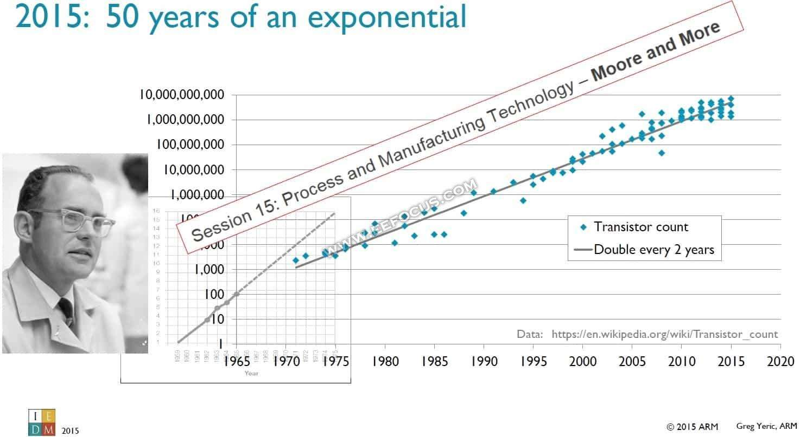
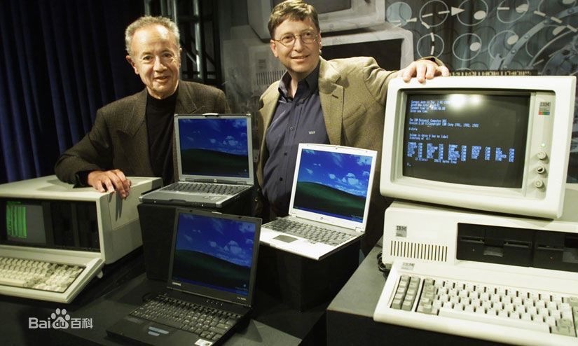
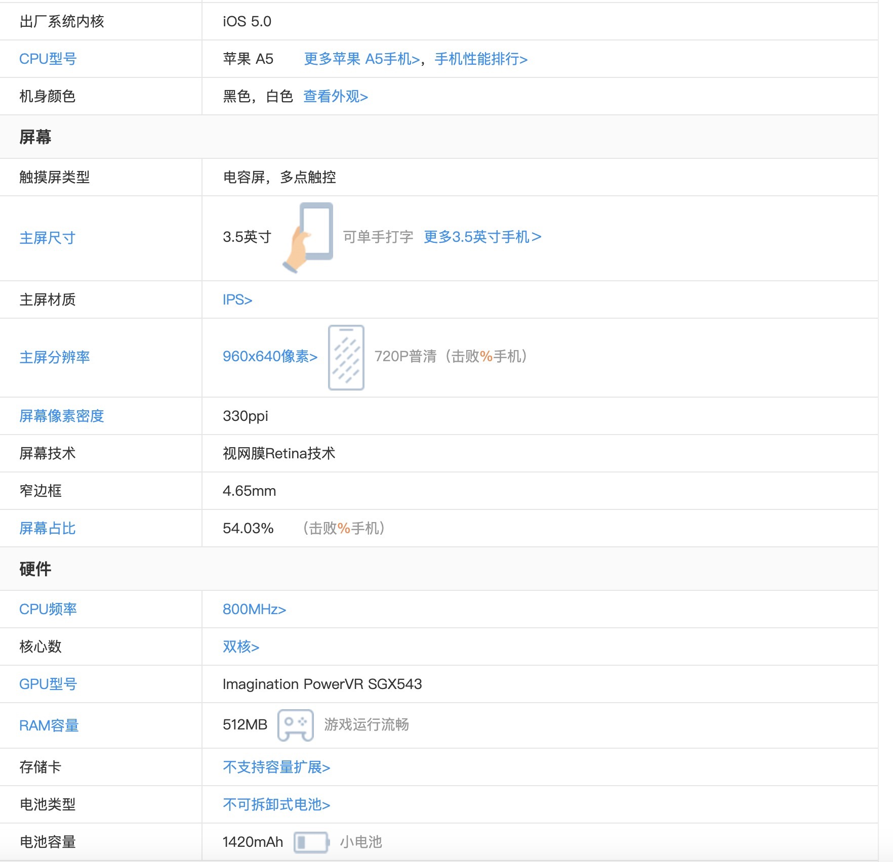
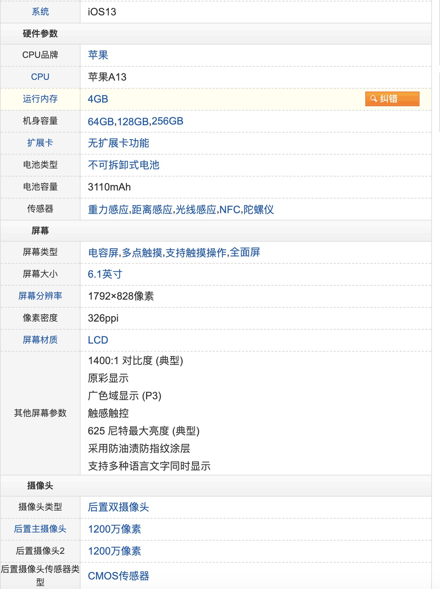
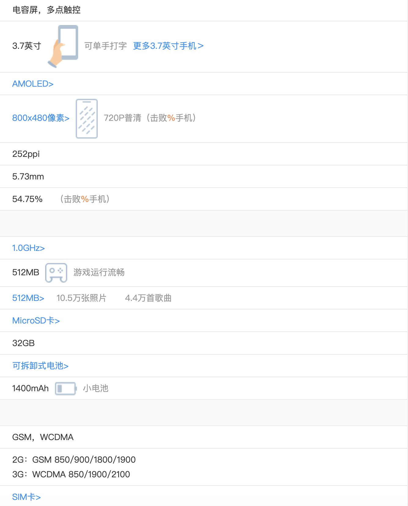
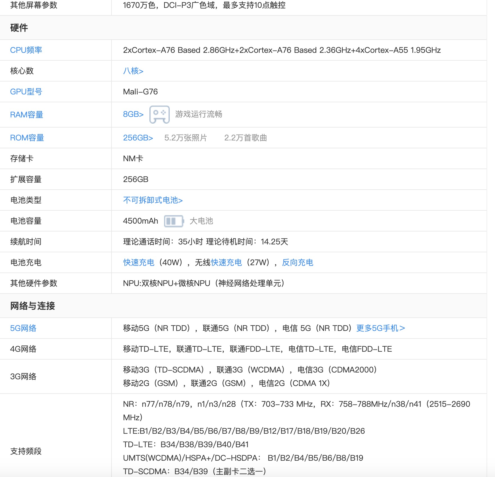
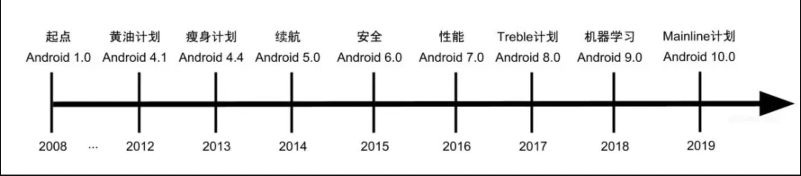

# 架构(大前端)

每个程序员或多或少都有自己设计一个框架甚至成为架构师的梦想,那么我们首先要了解架构的定义,什么是架构?

## IT行业的定律

	- 摩尔定律    
	- 安迪-比尔定律  
	- 反摩尔定律

- 摩尔定律说的是,硬件集成的速度每2年翻一番,后来人们把这个时间压缩到18个月,也就是说我们每18个月左右 性能就能翻一倍,我们手中的同档次电子产品价格就会减少一倍,同样进步迅速的不止硬件,也包括电信行业  和传统行业比起来,例如汽车行业,IT行业的发展速度是不可思议的. 那么硬件的发展速度和我们软件有什么关系呢?

- 安迪-比尔定律 原意是 比尔拿走了安迪提供的  比尔就是微软的著名前总裁比尔盖茨,安迪是主导了Intel20年的前ceo安迪格鲁特.都是IT行业鼎鼎有名的人物,

	原本是说Intel多猛的硬件,微软都会用越来越臃肿的软件吃掉增长的硬件性能,放在其他硬件厂商身上,
	也是同样适用.当然2010年之后,个人计算机市场逐渐变冷,这个定理更好的转移到了智能手机上.我们手
	机更新的频率大概就是这样.10年之后个人电脑市场或许不太适合这个定理,手机行业扛起了这个大旗
	(主要是ARM+android)
	
 
   

从这定律来看再这样高速发展的行业,我们软件的架构设计一定要具备一定的前瞻性,特别是我们的基础架构,特别是和硬件具有比较强关联性的模块.
	

- 反摩尔定律是Google前CEO埃里克.施密特提出的 意思是指如果一个IT公司18个月前卖掉同样多的,同样的产品,它的营业额就会降一半,反摩尔定理有逼着所有的IT公司跟上摩尔定理所规定的更新速度,从这里看IT行业恐怖的淘汰率和进步效率, 我们身处其中还是有点恐怖的,

反摩尔定律正面的意义更大,促成了科技领域的进步,它使IT行业不可能像传统行业一样只追求量变,还必须得不断寻找革命性的创造发明,在新的技术面前,没有包袱的小公司往往比臃肿的大公司更有动力,对于从业人员更是极为有利的一件事情,IT行业因为原材料成本并不高,主要的成本主要集中在研发领域,主要的生产资料就是IT行业的从业人员,由于安迪-比尔定律的作用 软件行业实际是处于IT行业的上游,我们是某种意义上的幸运者,同样的痛苦就是 如果一个人18个月没有更新自己的技术栈,那么对比与其他的从业者来说就是作用减少了一半.技术之路如同逆水行舟,不进则退.

- 以上理论唯一例外的是苹果公司

## 前端主要的设计模式

	前端的诞生时间相对于后台时间相对较短，移动端开发更是上一头在风口上的猪，借助这股东风，移动端
	开发更是瞬间成为 一个大多数团队中不可或缺的一环。传统前端的演进历史就非常久远，从jsp,php发
	展到Vue，React。2008 google Android正式发布1.0版本，同一场GoogleI/O大会中另外一个重
	要的东西同时发布,v8引擎

优秀的架构都是演进而来的,从来不是一蹴而就的,上图就是Android系统的演进架构,虽然Android的版本在不停的迭代优化和增加新的功能,但是基本的框架却基本没有改变

- 参考 [Android平台架构](https://developer.android.google.cn/guide/platform?hl=zh-cn) 
-  参考 [Android技术架构演进与未来](https://mp.weixin.qq.com/s/W38aauoCEEUbL8KvUkb_Rw?)

我个人的看法是,架构就是在面对当前的业务场景下给出合适甚至最优的解决方案,保障业务的快速迭代,增质提速使我们的最终目标

前段的架构设计模式 MVC/MVP/MVVM都是我们常见的设计模式 或者我们说 MV*

首先我们来解释  MVC的含义

- M  `model层`   主要包含数据结构的定义,数据库,网络I/O等.

- V  `view层`     显示UI.

- C  `controller层`  根据model层的数据对view层数据进行控制.

我个人对于`mvc`架构的理解对于移动端和前端来说`controller`对`view`是强耦合的甚至都是一一对应的,一个view对应一个`controller`,`controller`和`view`捆绑起来才是一个组件,对于客户端`model`层有是比较轻的一层,主要包括网络`I/O`和本地数据库等 有因为一些本地的数据和view控件的输入有着强关联,大量的具体业务逻辑代码都集中在`controller`中去处理,使得的`controller`变得无比臃肿.

- MVP  `presenter`
 
`mvp`架构好的方式是接触了`view`和`controller`的绑定,进行改造,使view拥有了UI组件的结构,还有了 处理用户事件的能力,就能将`controller`独立出来,我们在根据不同的业务去创建不同的`presenter`,一个view可以共用同一个`presenter`和同时使用多个`presenter`,我们可以把日趋复杂的页面和复杂的view给独立出来,形成某种意义上的复用.

- MVVM view-model

其中最重要的特性就是数据绑定,`Data-bingding` 其实在`Angular.js`,`React.js`,`vue.js`等热门框架都具备这种能力,它抛弃了Presenter提供接口的方式,由Persenter负责数据同步交给了viewModel中的数据绑定进行处理,简化了业务与页面的依赖,也解决了数据频繁更新的问题,降低了很多的耦合,提高了应用的可重用性.

`数据绑定`如果让我用一句话去形容通过框架生成大量的代码实现动态的监听数据或页面的变化,然后通知另外一方.

主要事项的方式大概有以下几种:

- 数据劫持(vue)
- 脏值查询(Angular1.X版本)
- 发布-订阅模式(KnocKout)

Vue使用的 数据劫持和发布订阅模式 ,通过ES5提供的`Object.defineProperty() `方式监控每个属性的getter,setter,在数据变化时通知订阅者,触发相应的监听回调.

``